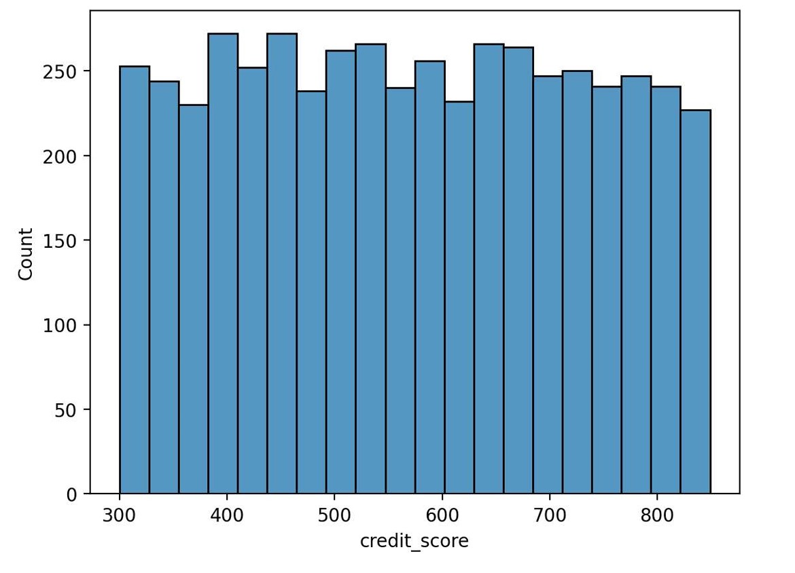
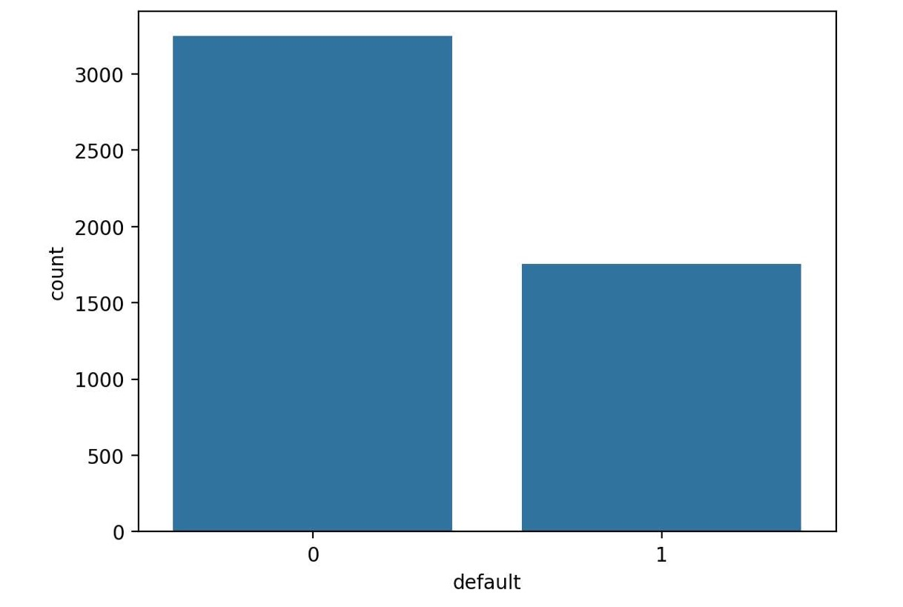
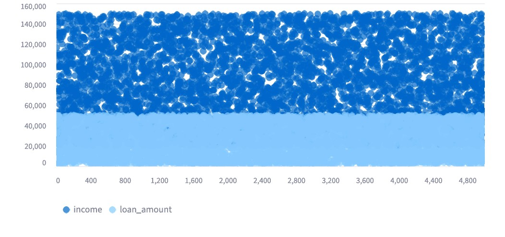
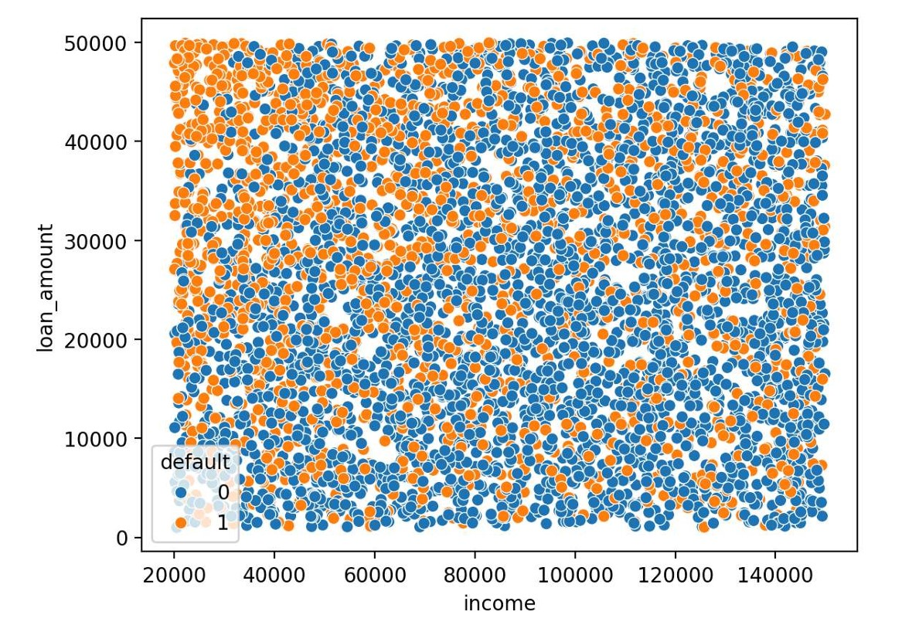
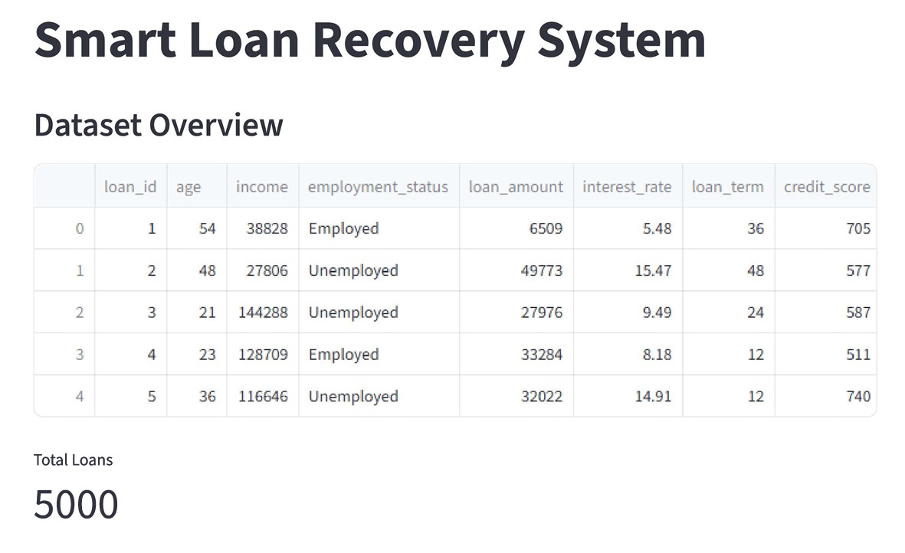
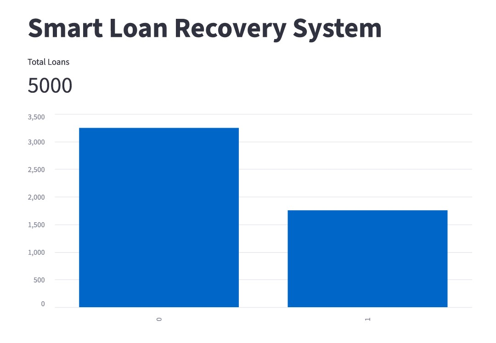

# Smart Loan Recovery System

## Overview
The **Smart Loan Recovery System** leverages machine learning to predict borrowers who might default on their loans. It provides actionable recovery strategies to help banks and financial institutions minimize losses and recover funds more efficiently.

## Objective
The goal of this project is to **identify high-risk borrowers early** and recommend effective recovery actions so lenders can improve loan recovery success.

## Tech Stack
- **Python** – Core programming language  
- **Pandas** – Data manipulation and analysis  
- **Scikit-learn** – Machine learning modeling  
- **SQL** – Data querying and analysis  
- **Flask** – API development  
- **Streamlit** – Interactive dashboard for visualization  

## Features
- Predicts loan default probability for each borrower  
- Generates a **risk score** for prioritization  
- Suggests **customized recovery strategies**  
- Performs loan data analysis using SQL  
- Interactive dashboard using Streamlit  
- Flask API for programmatic predictions  

## How It Works
1. **Data Collection & Cleaning** – Prepare the loan dataset  
2. **Feature Engineering** – Create relevant features to improve predictions  
3. **Model Training** – Train machine learning models for default prediction  
4. **Risk Scoring** – Assign a risk score to each borrower  
5. **Recovery Strategies** – Recommend actions based on risk levels  
6. **Visualization** – Display insights via an interactive dashboard  

### Dashboard Home

## Default Distribution

## Income vs Loan Amount

## Income vs Loan

## System Overview

## Total Loan

## Project Structure

SMART_LOAN_RECOVERY_SYSTEM/
│
├── Images/
│   ├── dashboard_home.jpg
│   ├── default_distribution.jpg
│   ├── income_loan_amount.jpg
│   ├── income_vs_loan.jpg
│   ├── system_overview.jpg
│   └── total_loan.jpg
│
├── api/
├── dashboard/
├── data/
├── database/
├── models/
├── notebook/
├── sql/
├── src/
│
├── loan_database.db
├── main.py
└── README.md

## Outcome
This system helps banks and lenders **predict defaults, prioritize recovery actions, and streamline the loan recovery process** using data-driven insights.

## About Me
**Shubham Panchal**  
Aspiring **Data Scientist | Machine Learning | AI | Data Analytics**

[LinkedIn Profile](https://www.linkedin.com/in/shubham-panchal-a100282a8/)
